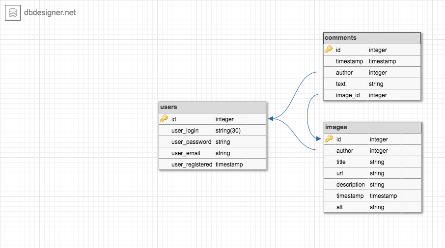

ProjectTitle: WebDev5_imgur

This project is...

Getting Started:

These instructions will get your copy of the project up and running on your local machine for development and testing purposes.

Prerequisites:

You will need to import these MySQL files into your server database before running the repository.
Run/Import them in order. File Locations: within prerequisites folder

1. prerequisites/create-tables.sql 
    - run/import create-tables.sql to generate the database tables
    (create-tables.sql creates the database tables for inserting your data for users, images, and comments)
2. prerequisites/import.sql 
    - run/import second to add users, images, and comments data to your database
    (import.sql contains an export of the all the users, images, and comments database after the database tables were created)

MySQL Database Tables: 

Within the prerequisites folder, please take a look at database_design.png for my database layout.
prerequisites/database_design.png

Built with:

PHPStorm - web framework used, platform
MAMP - localhost to test website
MyPhpAdmin - database
dbdesigner.net - where I designed and exported my database tables

Versioning:

v1.0
v1.1
v1.2

Author:

Melissa Sattler <melissa.i.sattler@gmail.com>

Acknowledgments

imgur.com , thanks for the inspiration.
Micah Wood, thanks for teaching me what I know about PHP.
